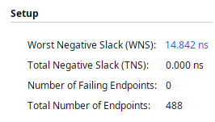
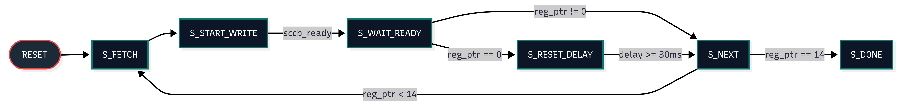

# FPGA Video Surveillance System with PIR Motion Detection & VGA Intruder Alert
### Autor: Pușcașu Dorin
<!--# Sistem de Supraveghere Video pe FPGA cu Detecție PIR și Alertă VGA-->
---

## Istoric Revizii

| Versiune | Data       | Autor         | Descriere |
| :---:    | :---:      | :---:          | :---      |
| **v0.1** | 07.07.2026 | Pușcașu Dorin | *Draft*   |
| **v0.2** | 10.07.2026 | Pușcașu Dorin | *Am îmbunătățit         documentația și am implementat etapele: 2, 3, 4*    |
| **v0.3** | 23.07.2026 | Pușcașu Dorin | *Am îmbunătățit         documentația și am implementat etapele: 5, 6*    |

---

<figure>
  
  <figcaption align="center"><b>Fig. 1:</b> Schema electrica</figcaption>
</figure>

---
<figure>
  
  <figcaption align="center"><b>Fig. 2:</b> Arhitectura Sistemului OV7670 - VGA</figcaption>
</figure>

---

<table>
  <tr>
    <!-- Coloana stânga: Tabelul de resurse -->
    <td valign="top">

| Resource | Utilization | Available | Utilization % |
| :--- | ---: | ---: | ---: |
| LUT | 520 | 20800 | 2.50 |
| FF | 163 | 41600 | 0.39 |
| BRAM | 19 | 50 | 38.00 |
| DSP | 2 | 90 | 2.22 |
| IO | 35 | 106 | 33.02 |
| BUFG | 3 | 32 | 9.38 |
| MMCM | 1 | 5 | 20.00 |

  </tr>
</table>

---

##  Cuprins
- [FPGA Video Surveillance System with PIR Motion Detection \& VGA Intruder Alert](#fpga-video-surveillance-system-with-pir-motion-detection--vga-intruder-alert)
    - [Autor: Pușcașu Dorin](#autor-pușcașu-dorin)
  - [Istoric Revizii](#istoric-revizii)
  - [Cuprins](#cuprins)
  - [Obiectivele Proiectului](#obiectivele-proiectului)
    - [Obiectiv General](#obiectiv-general)
    - [Obiectiv Personal](#obiectiv-personal)
  - [Etapa 1 - Documentația proiectului](#etapa-1---documentația-proiectului)
  - [Etapa 2 - Proiectarea și simularea controlerului VGA](#etapa-2---proiectarea-și-simularea-controlerului-vga)
  - [Etapa 3 - Implementarea pe hardware](#etapa-3---implementarea-pe-hardware)
  - [Etapa 4 - Afișarea și mișcarea unui obiect pe ecran](#etapa-4---afișarea-și-mișcarea-unui-obiect-pe-ecran)
  - [Etapa 5 - Integrarea camerei și afișarea imaginilor](#etapa-5---integrarea-camerei-și-afișarea-imaginilor)
  - [Etapa 6 - Interfațarea senzorului de mișcare](#etapa-6---interfațarea-senzorului-de-mișcare)
  - [Etapa 7 (Bonus) - Trimiterea imaginii captate prin UARTv la PC](#etapa-7-bonus---trimiterea-imaginii-captate-prin-uartv-la-pc)

---

## Obiectivele Proiectului

### Obiectiv General
* **Implementarea etapizată a unui controler VGA** cu rezoluția baseline de **640x480**.
* **Afișarea dinamică a unei imagini** și randarea elementelor grafice pe ecran.
* **Integrarea componentelor hardware externe**, incluzând un senzor detector de mișcare (PIR) și un modul de cameră video.

---

### Obiectiv Personal
* **Înțelegerea fundamentală a modului în care funcționează protocolul de sincronizare VGA și dobândirea de experiență practică în proiectarea, simularea și testarea sistemelor digitale complexe folosind limbajul Verilog.**

---
## Etapa 1 - Documentația proiectului 
* **Obiectiv:** Definirea temei, a cerințelor funcționale și proiectarea arhitecturii de ansamblu a sistemului pe FPGA, având ca repere:
* **Documentarea protocoalelor de comunicație:** SCCB pentru configurarea camerei OV7670 și standardul VGA pentru generarea semnalelor de sincronizare (`Hsync`, `Vsync`).
* **Dimensionarea memoriei interne Block RAM (BRAM)** în raport cu rezoluția imaginii (QVGA) și formatul de reprezentare a pixelilor.
* **Proiectarea schemei bloc de nivel înalt (Top-Level)** și definirea interfețelor dintre module (captură, memorie, afișare, achiziție senzor PIR și gestiune ceasuri).

---

## Etapa 2 - Proiectarea și simularea controlerului VGA
* **Obiectiv:** Crearea logicii în Verilog pentru semnalele de sincronizare VGA la rezoluția baseline de 640x480 @ 60Hz și verificarea lor în simulator.
* **Realizare:** Am implementat numărătoarele pentru axele orizontală (`h_count`) și verticală (`v_count`), am generat semnalele active-low `h_sync` și `v_sync` și am folosit un banc de teste (testbench) pentru a vizualiza formele de undă.
* **Dificultăți:** Erori de testbench: sincornizare si reset.
* **Mod de rezolvare:** Am efectuat un proces de debugging pe codul Verilog pentru a identifica liniile problematice. Am corectat erorile de logică din modulele de sincronizare pentru semnalele `h_sync` și `v_sync`, asigurând temporizarea corectă cerută de monitor. De asemenea, am remediat comportamentul la reset prin includerea explicită a canalului de culoare Roșu în starea de inițializare.

---

## Etapa 3 - Implementarea pe hardware
* **Obiectiv:** Sintetizarea proiectului în Vivado, maparea pinilor fizici și afișarea unei culori pe un monitor VGA real.
* **Realizare:** Am creat un Block Design în Vivado, am adăugat un IP CLock Wizard pentru a genera un PLL de 25.175MHz. Am scris fișierul de constrângeri (`.xdc`) alocând pinii corespunzători ieșirilor video și de ceas. Am generat bitstream-ul și am programat placa FPGA.
* **Dificultăți:** -
* **Mod de rezolvare:** - 

---

## Etapa 4 - Afișarea și mișcarea unui obiect pe ecran
* **Obiectiv:** Desenarea unei forme geometrice (ex: un pătrat/obiect) pe ecran și implementarea unei logici cinematice pentru deplasarea acestuia.
* **Realizare:** * **Realizare:** Am creat un circuit de generare a pixelilor care verifică dacă poziția curentă (`h_count`, `v_count`) se află în interiorul coordonatelor obiectului și la fiecare cadru complet (V-Sync) obiectul se misca.
* **Dificultăți:** Initial obiectul de pe ecran nu aparea cum trebuie si dupa ce am facut obiectul sa se miste se bloca in colturi.
* **Mod de rezolvare:** Am corectat limitele geometrice (coordonatele bounding box) ale obiectului, rezolvând astfel problema distorsionării grafice. Pentru a elimina blocajele din colțuri, am ajustat condițiile de coliziune cu marginile ecranului (din partea stanga si de sus): am înlocuit testarea eronată a pixelului absolut `0` pe axele X și Y cu o limitare la primul pixel vizibil din zona activă (`1`), asigurând o schimbare fluidă a direcției de mișcare.

---

## Etapa 5 - Integrarea camerei și afișarea imaginilor
* **Obiectiv:** Preluarea unui flux video de la o cameră externă (sau imagini predefinite), stocarea datelor într-o memorie internă și randarea lor dinamică pe VGA.
* **Realizare:** Implementarea modulelor de control pentru camera OV7670 (ov7670_sccb, ov7670_init, ov7670_capture). Datele ale pixelilor recepționați de la cameră pe magistrala ov7670_data sunt capturate sincron pe frontul PCLK și stocate într-o memorie internă Dual-Port BRAM (frame_buffer). În paralel, modulul de afișare VGA (vga_controller / vga_img_display) citește adresele din BRAM sincronizat cu ceasul de afișare și randează fluxul video în timp real pe monitor.
* **Dificultăți:** Afișarea imaginii pe ecran prezenta artefacte (imagine distorsionată, culori inversate/greșite, liniamente defazate sau imagine neclară) din cauza neconcordanțelor de timing la achiziția pixelilor și a configurării greșite a formatului de ieșire al camerei.
* **Mod de rezolvare:** Am refacut implementarea protocolului SCCB, Am Ajustat tabelul de registre de inițializare a camerei (setarea formatului corect de pixeli și activarea scalării la rezoluția dorită, setarea formatului de culoare in YUV in loc de RGB) și am corectat logica din modulul ov7670_capture pentru a asambla corect cei 2 octeți corespunzători fiecărui pixel.
---
<figure>
  
  <figcaption align="center"><b>Fig. 3:</b> Diagrama FSM-SCCB</figcaption>
</figure>

SCCB - Serial Camera Control Bus

---

<figure>
  
  <figcaption align="center"><b>Fig. 4:</b> Diagrama FSM_OV7670_INIT</figcaption>
</figure>

---

## Etapa 6 - Interfațarea senzorului de mișcare
* **Obiectiv:** Conectarea senzorului de mișcare (PIR) la FPGA și utilizarea stării acestuia pentru a influența memoria BRAM a FPGA-ului care stocheaza imaginea primita de la camera.
* **Realizare:** Conectarea ieșirii digitale a senzorului PIR la un pin de intrare al FPGA-ului (pir_sensor). Preluarea stării senzorului și integrarea acesteia în logica de control a sistemului pentru a acționa asupra memoriei frame_buffer (de exemplu: oprirea scrierii în BRAM pentru a „îngheța”/salva cadrul în momentul detectării mișcării sau modificarea modulului de afișare VGA).
* **Dificultăți:** -
* **Mod de rezolvare:** -

---

## Etapa 7 (Bonus) - Trimiterea imaginii captate prin UARTv la PC
* **Obiectiv:** Transmiterea datelor binare ale imaginii salvate în memoria FPGA-ului (BRAM) către un calculator, utilizând protocolul de comunicație serială UART.
* **Realizare:** -
* **Dificultăți:** - 
* **Mod de rezolvare:** - 

